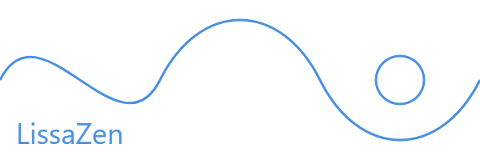

# LissaZen

## Overview

LissaZen is an open-source, mathematically-inspired relaxation application designed to guide users into a state of deep tranquility.

## 🚧 Current Development Status

### Implemented
- Lissajous curve generation
- Basic two-object visualization system

### Roadmap
- [ ] Procedural ambient music generation
- [ ] Virtual Reality (VR) support
- [ ] Expanded visualization techniques
- [ ] More mathematical curve exploration

## 🛠 Installation

### Prerequisites
- Unity Version: `6000.0.40f1`
- Git

### Setup Steps
1. Clone the repository
2. Open the project in Unity
3. That's all

## 🎮 Usage

### For Users
- Download the latest release from the Releases section
- Run

### For Developers
Interested in contributing? Feel free to do it

## 📄 License

Distributed under the MIT License. See `LICENSE` for more information.